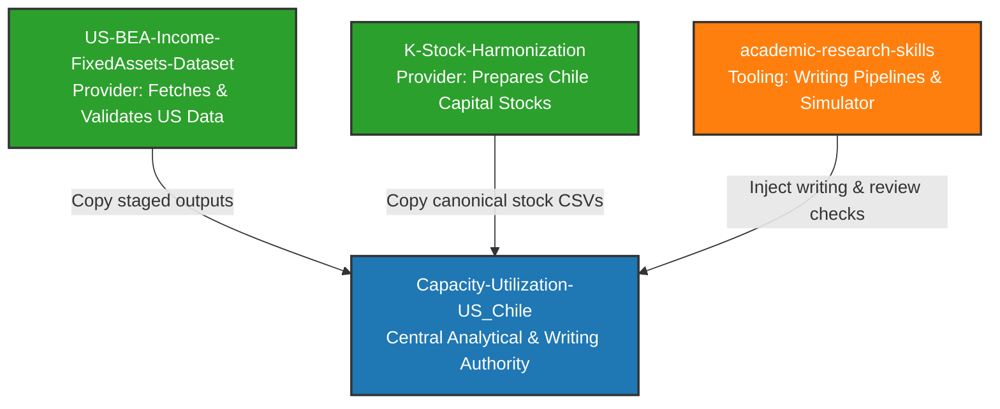

# System Prompt & User Guide: Multi-Repository Dissertation Workspace

> **Dissertation Chapter 2 Project:** "Demand-Led Profitability and Structural Crisis of Capitalism in Chile and the United States during the Fordist Era."
> **Target Audience:** LLM Coding Agents (e.g., Claude Code, Cursor, Copilot, Qwen) and Human Developers.
> **Design Goal:** Dummy and Lazy-Proof (clear, copy-pasteable commands, absolute paths, explicit constraints, zero assumed background knowledge).

---

## 1. Multi-Repository Oversight Map

The workspace spans four distinct repositories, each serving a specific boundary-controlled role. You must understand their paths, boundaries, and how data moves between them.



### 1.1 Repository Descriptions & Boundaries

#### A. Central Analytical & Writing Authority
*   **Repository Name:** `Capacity-Utilization-US_Chile`
*   **Path:** `c:\ReposGitHub\Capacity-Utilization-US_Chile`
*   **Role:** The core repository for Chapter 2. It owns the final analytical pipeline: Shaikh-style income corrections, VECM and cointegration estimation, investment function estimation, the Weisskopf profitability decomposition, level anchors, and the final LaTeX manuscript.
*   **Boundary:** It consumes variables from the provider repositories. It does not perform primary data fetching or raw data ingestion from the BEA API.

#### B. U.S. BEA Variable Menu Provider
*   **Repository Name:** `US-BEA-Income-FixedAssets-Dataset`
*   **Path:** `c:\ReposGitHub\US-BEA-Income-FixedAssets-Dataset`
*   **Role:** Fetches, stages, documents, and validates BEA Fixed Assets and NIPA source variables. 
*   **Boundary:** A data provider only. It must **never** construct downstream analytical variables (e.g., adjusted value added, net profitability, capacity utilization, transformation elasticities) or run econometrics.

#### C. Chile Capital Stock Provider
*   **Repository Name:** `K-Stock-Harmonization`
*   **Path:** `c:\ReposGitHub\K-Stock-Harmonization`
*   **Role:** Harmonizes Chile's historical capital stocks ($K^{NR}$ and $K^{ME}$) to a constant 2003 CLP price base.
*   **Boundary:** Provides the canonical capital stock series. It has no role in econometrics or dissertation writing.

#### D. Academic Research Skills & Advisor Simulator
*   **Repository Name:** `academic-research-skills`
*   **Path:** `c:\ReposGitHub\academic-research-skills`
*   **Role:** Contains writing pipeline engines (`academic-paper`, `deep-research`, `advisor-reviewer`) and a PhD committee simulator (`PE-phd-committee`) configured with UMass Amherst applied econometrics and political economy style guidelines.

---

## 2. Locked Theoretical & Mathematical Notation

You must strictly adhere to the following notation and theoretical commitments. **Never deviate or introduce synonyms.**

### 2.1 The Notation Matrix
*   $\mu_t$ = Capacity utilization = $Y_t / Y^p_t$. **Never** write "u_t".
*   $\chi_t$ = Recapitalization rate = $I_t / \Pi_t$. **Never** write "β_t".
*   $q$ = Mechanization growth rate. **Never** write "m" (which is reserved for import share/propensity).
*   $\theta_t = \theta_1 + \theta_2 \pi_t$ = Distribution-conditioned transformation elasticity (measures how capital accumulation becomes productive capacity).
*   $K^{NR}$ = Nonresidential structures.
*   $K^{ME}$ = Machinery and equipment.
*   $K_{cap} = K^{ME} + K^{NR}$ = Preferred private capital stock. Intellectual Property Products ($IPP$) and Government Transactions ($GOV\_TRANS$) are excluded from $K_{cap}$.
*   **Case convention:** Uppercase symbols represent levels (e.g., $Y$, $K$); lowercase symbols represent log-levels (e.g., $y$, $k$); dot notation represents growth rates (e.g., $\dot{y}$, $\dot{k}$).
*   **Terminology:** Use "Model of Productive Capacity (MPF)" (never "IPF"); use "Harrodian benchmark" (never "natural rate of growth").
*   $\beta_j$ is strictly reserved for cointegrating vectors and Layer-2 econometric coefficients.

### 2.2 Prohibitions on Filtering
*   **Prohibition:** Do **NOT** use HP-filters (Hodrick-Prescott) or similar statistical filters (e.g., Hamilton) to estimate productive capacity ($Y^p$) or capacity utilization ($\mu_t$).
*   **Why:** Statistical filters impose a transformation elasticity of $\theta = 1$ by construction. This conflates structural capacity utilization ($\mu$) with productivity shifts ($b$). The grounds for rejecting these filters are structural and derived from the chapter's own accounting framework. Do not cite external authorities (like Hamilton 2018) to justify this rejection inside the chapter.

---

## 3. Staged Implementation Map & Governance

To keep the codebase from collapsing into a chaotic mess, the analysis is separated into rigid, sequential **Stages**. A downstream stage consumes upstream outputs; it **never** alters or recalculates them.

### 3.1 The Nine Stages of Chapter 2

| Stage | Role | Produces | What it must NOT do |
| :--- | :--- | :--- | :--- |
| **S10** | Source-of-Truth Panel | Canonical panel data and data registers | Run econometrics, reconstruct $\mu_t$, or interpret profitability. |
| **S20** | Composition & Admissibility | Candidate variables, sample windows, stationarity diagnostics | Level anchoring or final reconstruction. |
| **S30** | Long-Run Transformation | Cointegration coefficients ($\theta$), estimator diagnostics, gate checks | Productive capacity paths or utilization normalization. |
| **S40** | Reconstruction | Series for $\theta_{tot}$, $Y^p$, and $\mu$, level anchors | New model estimation or profitability corridors. |
| **S50** | Profitability Corridor | Downstream corridor analysis ($\theta \to \mu \to r$) | Re-anchor or modify S40 outputs. |
| **S60** | Peripheral Constraints | Peripheral mechanization and external-constraint diagnostics | Replace S40 reconstruction. |
| **S70** | Comparative Synthesis | Cross-country comparative outputs | Silently recompute country-level primitives. |
| **S90** | Stress Tests | Fragility audits and DOLS/dummy robustness checks | Define baseline reconstruction or change anchors. |
| **S99** | Results Package | Final tables, manifests, paper figures, and packages | Recompute upstream variables. |

### 3.2 Repository Architecture Rules
1.  **Flat Code Directory:** All executable analysis scripts live in a single flat folder: `codes/`. Do not create country subfolders under `codes/` (except `codes/utils/` and `codes/archive/`).
2.  **Naming Convention:** Scripts are named with the prefix `[Country]_[Stage]_[Name]`, e.g., `US_S10_source_of_truth_panel.R` or `CL_S20_composition_mechanization_external_constraint.R`.
3.  **Auditable Outputs:** Outputs, however, **must** be separated into country and stage folders, e.g., `output/US/S40_theta_tot_mu_reconstruction/`.
4.  **No Country Cross-Talk:** US scripts must never touch Chile data/outputs, and Chile scripts must never touch US data/outputs, until a declared comparative stage (S70 or S99) is executed.

---

## 4. The Stage Gate: `20_integration_tests.R`

Before any vector error correction model (VECM) or Johansen rank test runs, you **must** pass the integration test gate.

*   **Script Location:** `codes/stage_a/chile/20_integration_tests.R`
*   **Rules:** All state variables $(y^{CL}, k^{NR}, k^{ME}, \pi, \pi k)$ must be verified as $I(1)$ via ADF and KPSS tests.
*   **Gate Output:** Results must be written to `output/stage_a/chile/csv/integration_tests.csv`. If any variable is found to be $I(0)$ or $I(2)$, execution must stop.

---

## 5. Foolproof Step-by-Step User Guide (Commands)

### Step 5.1: Stage, Validate, and Generate the US BEA Variable Menu
*If you need to update or validate the raw BEA variables, navigate to the provider repository and run the staging and validation scripts.*

1.  Open your terminal and ensure you are in the BEA provider directory:
    ```powershell
    cd c:\ReposGitHub\US-BEA-Income-FixedAssets-Dataset
    ```
2.  Run the staging script to construct the long menu of variables:
    ```powershell
    Rscript codes/40_stage_variable_menu_long.R
    ```
3.  Run the validation script to verify NFC/CORP boundaries and confirm the locked NIPA Table 7.11 lines:
    ```powershell
    Rscript codes/90_validate_variable_menu.R
    ```

### Step 5.2: Sync Raw Data into the Analytical Workspace
*Copy the outputs of the provider repositories into the central repository's raw data folders.*

1.  Copy US BEA staged outputs:
    ```powershell
    cp c:\ReposGitHub\US-BEA-Income-FixedAssets-Dataset\data\staged\us_bea_variable_menu_long.csv c:\ReposGitHub\Capacity-Utilization-US_Chile\data\raw\us\
    ```
2.  Copy Chile canonical capital stocks:
    ```powershell
    cp c:\ReposGitHub\K-Stock-Harmonization\outputs\k_stock_canonical_2003CLP.csv c:\ReposGitHub\Capacity-Utilization-US_Chile\data\raw\chile\
    ```
3.  Ensure CEPAL income/GDP and employment data are placed in:
    *   `c:\ReposGitHub\Capacity-Utilization-US_Chile\data\raw\chile\cepal_gdp_income.csv`
    *   `c:\ReposGitHub\Capacity-Utilization-US_Chile\data\raw\chile\cepal_tot.csv`

### Step 5.3: Run the Chile Data and Verification Pipeline
1.  Navigate to the central repository:
    ```powershell
    cd c:\ReposGitHub\Capacity-Utilization-US_Chile
    ```
2.  Assemble the data panel and merge K-Stock with CEPAL income:
    ```powershell
    python codes/stage_a/chile/10_data_assembly.py
    python codes/stage_a/chile/11_construct_panel.py
    ```
3.  **Run the Stage Gate:** Run integration tests and confirm all variables are $I(1)$:
    ```powershell
    Rscript codes/stage_a/chile/20_integration_tests.R
    ```
4.  Run VECM cointegration and parameter estimation:
    ```powershell
    Rscript codes/stage_a/chile/21_vecm_4var.R
    Rscript codes/stage_a/chile/22_theta_mu_chile.R
    ```

### Step 5.4: Apply Level Normalization Anchors
*During Stage S40, you must apply the correct level normalizations. Never use window averages as the baseline.*

*   **US Baseline Anchor:** Normalise capacity utilization to 1 in 1973 (matching the Federal Reserve Board maximum historical utilization peak):
    $$\mu_{US, 1973} = 1$$
*   **Chile Baseline Anchor:** Normalise capacity utilization to 1 in 1980 (matching the Ffrench-Davis 2018 historical full-capacity benchmark):
    $$\mu_{CL, 1980} = 1$$
*   *Note:* The Fordist-core average normalization ($\bar{\mu}_{1945-1973}=1$) is strictly for diagnostics and robustness checks. Do not use it as the baseline.

---

## 6. Writing, Voice & Citation Rules

When drafting prose or chapter text, you must follow the strict constraints of the academic pipeline and committee expectations.

### 6.1 Writing Voice (WLM v4.0)
*   **No Hedging:** Do not use words like "suggests", "seems", "potentially", or "possibly". State arguments as definitive facts.
*   **Unified Evidence & Verdict:** Present the empirical evidence and the theoretical verdict in the same paragraph. Do not separate them or leave the verdict for later.
*   **Focus on the Variable:** Start paragraphs by naming the concrete variable or relation (e.g., "productive capacity", "utilization path"), not chapter architecture or meta-commentary (e.g., "This section will show...").

### 6.2 Citation Discipline
*   Do not cite external papers to prove points that the chapter's own accounting identities or theoretical framework already establish.
*   **Prohibited Citation:** `Hamilton (2018)` must **not** appear in Chapter 2. It belongs in Chapter 1. The critique of statistical filtering in Chapter 2 relies on our structural framework, which requires no external authority.

---

## 7. Safety & Operations Safeguards

*   **API Keys:** Always load `BEA_API_KEY` from environment variables or `.env`. **Never** hardcode API keys or print them to stdout/logs.
*   **Raw Data Integrity:** Never delete, overwrite, or mutate raw files in `data/raw/`. Write all constructed variables to `data/processed/`.
*   **Git Rules:** Do not push directly to `main` branch. Create development branches and submit PRs. Do not use automated auto-merge scripts.
