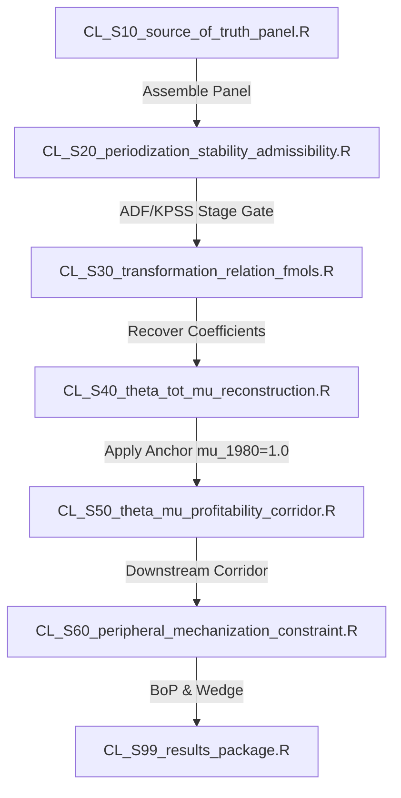

# Project Parking Manifest: Chapter 2 Workspace

This manifest serves as the central parking state and handoff document for the Chapter 2 dissertation workspace. It summarizes where the project stands as of **July 9, 2026**, lists active files, and details the three main pathways available to proceed.

---

## 1. Current Workspace Status

*   **Repository Structure:** Reorganized into a clean, consolidated layout. All writing, prompts, drafts, and style guides are located in the [chapter2/](file:///c:/ReposGitHub/Capacity-Utilization-US_Chile/chapter2/) root directory. The old `artifacts/` folder has been completely deleted.
*   **YAML Frontmatter Gatekeeping:** Major markdown files in the repository contain standardised YAML headers at the beginning, enabling agents to parse metadata and scope without consuming their context window.
*   **Git Status:** Completely clean working directory, committed on branch `main`.

---

## 2. Pathway A: Chile Empirical Pipeline Rebuild (CL_S10–CL_S99)

*   **Objective:** Recycle legacy Python and R scripts to construct flat, stage-compliant R scripts inside `codes/`.
*   **Current Status:** Legacy scripts are parked inside [codes/legacy/CL/](file:///c:/ReposGitHub/Capacity-Utilization-US_Chile/codes/legacy/CL/). There are no active `CL_` scripts inside the main `codes/` folder.
*   **The Rebuild Sequence:**

### 2.1 Legacy Files to Recycle
*   **For `CL_S10_source_of_truth_panel.R`:** Recycle `codes/legacy/CL/10_data_assembly.py`, `11_construct_panel.py`, `12_extend_panel_bcch.py`, and `13_merge_distribution.py`.
*   **For `CL_S20_periodization_stability_admissibility.R`:** Recycle `codes/legacy/CL/01_unit_root_tests.R` and `20_integration_tests.R`. **(Strict Stage Gate: state variables must be I(1))**.
*   **For `CL_S30_transformation_relation_fmols.R`:** Recycle `codes/legacy/CL/02_stage1_vecm.R` and `03_stage2_frontier_vecm.R` (using `cointReg` FM-OLS package).
*   **For `CL_S40_theta_tot_mu_reconstruction.R`:** Reconstruct $\theta_t^{CL}$ and potential output growth using the A03 composition identity. Apply the Ffrench-Davis (2018) point-year baseline level anchor:
    $$\mu_{CL, 1980} = 1.0$$
*   **For `CL_S50_theta_mu_profitability_corridor.R`:** Recycle `codes/legacy/CL/04_stageB_profitability.R` and `stageB_chile_4ch.R`.
*   **For `CL_S60_peripheral_mechanization_constraint.R`:** Implement the external mechanization wedge ($\mathcal{E}_t = \Lambda_t \varphi_t$) and the Balance-of-Payments recapitalization corridor.

---

## 3. Pathway B: U.S. Stage S40 Capacity & Utilization Reconstruction

*   **Objective:** Formally execute the Stage S40 reconstruction and S50 profitability corridor analysis for the U.S.
*   **Current Status:** Stage S30/S32 has been completed. The script `codes/reconstruct_golden_age_paths.R` has been run to calculate potential capacity growth under Specification B (composition-mediated) and Specification A (Shaikh-style) during the Golden Age (1945–1973). The results are saved to [output/US/reconstruction_comparison/us_golden_age_reconstructed_paths.csv](file:///c:/ReposGitHub/Capacity-Utilization-US_Chile/output/US/reconstruction_comparison/us_golden_age_reconstructed_paths.csv).
*   **Next Steps:**
    1.  Promote the FM-OLS coefficient vector ($\beta_k = 0.23784$, $\beta_{\tau} = 0.31207$, $\beta_{\text{inter}} = -1.02937$) recovered in S30.
    2.  Formally run the Stage S40 script, integrating potential output growth rate using the A03 composition identity, anchored at the point-year peak:
        $$\mu_{US, 1973} = 1.0$$
    3.  Create the active `US_S50_theta_mu_profitability_corridor.R` to decompose US profit rates ($r = \mu \cdot b \cdot \pi$) and evaluate whether the wage-share interaction is concave on the heterodox technology frontier.

---

## 4. Pathway C: Chapter 2 Prose Writing Sprint

*   **Objective:** Draft the locked outline sections using WLM v4.0 voice guidelines.
*   **Current Status:** High-quality drafts for §2.2 (Literature Review) exist in [chapter2/agents/drafts/s2_2_final_draft.md](file:///c:/ReposGitHub/Capacity-Utilization-US_Chile/chapter2/agents/drafts/s2_2_final_draft.md).
*   **Writing Checklist:**
    1.  **Inject the Voice Guide:** Always load [chapter2/voice/ch2_voice_guide.md](file:///c:/ReposGitHub/Capacity-Utilization-US_Chile/chapter2/voice/ch2_voice_guide.md) first to calibrate the writing engine.
    2.  **Consult the Outline:** Check the subsection structure in [chapter2/outline/Ch2_Outline_DEFINITIVE.md](file:///c:/ReposGitHub/Capacity-Utilization-US_Chile/chapter2/outline/Ch2_Outline_DEFINITIVE.md).
    3.  **Draft Targets:**
        *   *§2.3 Analytical Framework:* Draft the accounting foundation (Layer 1) and behavioral identification (Layer 2) equations.
        *   *§2.5 Stage A Methodology:* Explain the cost-minimization FOCs and the "I(2) Trap" / Polynomial Cointegration (CPR) framework verified in [chapter2/outline/method_assessment.md](file:///c:/ReposGitHub/Capacity-Utilization-US_Chile/chapter2/outline/method_assessment.md).
