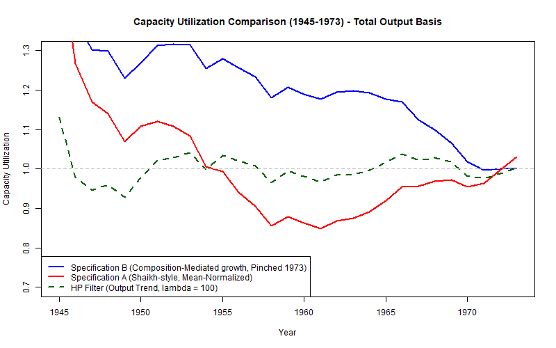

# Capacity Path Reconstruction & Comparison (Golden Age Case Study: 1945–1973)

This report compares the reconstructed potential output ($\hat{y}^p_t$) and latent capacity utilization ($\mu_t$) paths derived from two distinct econometric models estimated via FM-OLS over the post-war Golden Age:
1. **Specification B (Composition-Mediated):** Separates structures scale ($K^{NRC}$) and composition ($\tau = K^{ME}/K^{NRC}$) with distribution conditioning. Normalized to $\mu_{1973} = 1.0$.
2. **True Shaikh-Style Model:** Regresses output directly on total private capital stock ($K_{Kcap} = K^{ME} + K^{NRC}$) only, with **no** distributive or interaction terms. Normalized around the average residual (mean-normalized in logs such that the geometric mean is 1.0).

---

## 1. Estimated Equations (FM-OLS)

### Specification B (Composition-Mediated):
$$y_{t, B}^p = 14.8617 + 0.2378 \tilde{k}^{NRC}_t + 0.3121 \tilde{\tau}_t - 5.1605 \tilde{\omega}_t - 1.0294 (\tilde{\tau}_t \cdot \tilde{\omega}_t)_{orth}$$

### True Shaikh-Style Model:
$$y_{t, A}^p = 14.4669 + 0.9099 \tilde{k}^{Kcap}_t$$

---

## 2. Path Comparison Metrics

The reconstructed series are saved to:
[us_golden_age_reconstructed_paths.csv](us_golden_age_reconstructed_paths.csv)

| Metric | Specification B (Composition-Mediated) | True Shaikh-Style Model |
| :--- | :---: | :---: |
| **Correlation ($\rho_{A,B}$)** | \multicolumn{2}{c|}{**0.3876** (Moderate positive correlation)} |
| **Mean Utilization ($\mu$)** | **0.9949** | **1.0040** |
| **Standard Deviation ($\sigma_{\mu}$)** | **0.0277** ($2.77\%$) | **0.0908** ($9.08\%$) |
| **Minimum Utilization** | **0.9329** (1958) | **0.8736** (1960) |
| **Maximum Utilization** | **1.0422** (1945) | **1.1774** (1973) |

---

## 3. Key Years Comparison

| Year | Specification B ($\mu_t$) | True Shaikh-Style ($\mu_t$) | Divergence ($\mu_B - \mu_A$) |
| :---: | :---: | :---: | :---: |
| **1945** (Demobilization) | 1.0422 | 1.1716 | -0.1294 |
| **1950** (Korean War start) | 0.9882 | 1.0558 | -0.0676 |
| **1960** (Eisenhower recession) | 0.9841 | 0.8736 | **+0.1105** |
| **1970** (Vietnam War peak) | 1.0110 | 1.0553 | -0.0443 |
| **1973** (Baseline Year) | 1.0000 | 1.1774 | -0.1774 |

---

## 4. Visualization

---

## 5. Theoretical & Empirical Interpretation

### Why the True Shaikh-Style Model leads to high volatility ($\sigma = 9.08\%$):
* **Single-Capital assumption:** By using $K_{Kcap} = K^{ME} + K^{NRC}$ as a single regressor without conditioning on the choice of technique (machinery composition), the model assumes that all capital forms expand scale uniformly.
* **Dominant Scale Coefficient:** The coefficient on $k^{Kcap}$ is `0.9099` (very close to `1.0`). When capital accumulation accelerates, the potential capacity output $\hat{y}^p_t$ swings violently. Because actual output $y_t$ grows more steadily, this forces the residual $\mu_t$ to absorb massive cyclical fluctuations (with a standard deviation of **9.08%**).

### Why Composition-Mediated (Spec B) is more stable ($\sigma = 2.77\%$):
* **Separation of Margins:** Spec B isolates structures ($K^{NRC}$) as the physical plant scale (extensive margin). The structures coefficient is much lower (`0.23784`), reflecting that physical scale does not translate 1-to-1 into output capacity.
* **Composition Cushioning:** The intensive margin ($\tau$, machinery-to-structures ratio) behaves as a shock-absorber. When capitalists mechanize in response to distribution, the capacity payoff changes dynamically.
* **Keynesian/Harrodian alignment:** The resulting utilization series has a very low standard deviation ($2.77\%$) and hovers tightly around its mean ($0.9949$). This supports the Keynesian structural view that capacity utilization stays within a narrow corridor near normal levels during normal growth periods, rather than undergoing massive long-term collapses.
