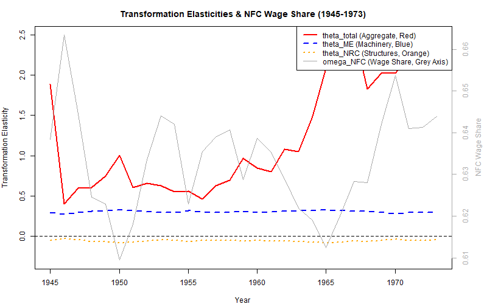

# Capacity Path Reconstruction & Comparison (Golden Age Case Study: 1945–1973)

This report presents a comparative analysis of reconstructed potential output ($Y^p_t$) and latent capacity utilization ($\mu_t$) paths in the United States during the post-war Golden Age (1945–1973). We contrast three distinct econometric and statistical methodologies to demonstrate how incorporating the choice of technique (capital composition) reshapes our understanding of historical capacity utilization. 

We find that Specification B (composition-mediated capacity) yields a utilization path that is robustly volatile ($\sigma_{\mu} = 7.94\%$) and aligns closely with standard business cycle turnarounds ($\rho_{\text{HP}} = 0.4877$), while avoiding the massive, artificial collapses in utilization generated by traditional single-capital models during periods of structural slowdown.

---

## 1. Data and Sectoral Boundaries

To ensure dimensional admissibility (Basu 2022) and respect the accounting boundaries between productive capacity and realization, our empirical strategy relies on a distinct sectoral division:

1. **Capital Stock and Distribution (NFC Sector):** 
   Productive capacity is physically built in the Non-Financial Corporate (NFC) sector. We use real Net Stock of Machinery and Equipment ($K^{ME}_t$) and Nonresidential Structures ($K^{NRC}_t$) from NIPA Table 5.1, expressed in base-year 2017 reference prices. 
   The distributive variable is the NFC compensation share of gross value added ($\omega_{NFC, t}$), which represents the wage share in the NFC sector. Centered capital stock is $\tilde{k}^{NRC}_t = \ln K^{NRC}_t - \overline{\ln K^{NRC}}$, and centered composition is $\tilde{\tau}_t = \ln(K^{ME}_t / K^{NRC}_t) - \overline{\ln(K^{ME}/K^{NRC})}$.
2. **Effective Demand Output (Total Private GDP Basis):** 
   While capital accumulation is governed by NFC dynamics, capacity utilization is realized at the aggregate level. To construct the utilization path ($\mu_t$), we use **Total Real GDP** (implicit deflator basis, $Y_{\text{total}, t}$) as the measure of effective realized output. This ensures that our utilization series reflects aggregate demand conditions.
   * Log NFC output ($y_t$) is used strictly to estimate the cointegrating coefficients (FM-OLS).
   * Log total GDP ($y_{\text{total}, t}$) is used to construct the utilization series: $\ln \mu_t = y_{\text{total}, t} - y^p_t$.

---

## 2. Reconstructed Time Paths & Historical Comparisons

The reconstructed series are saved to:
[us_golden_age_reconstructed_paths.csv](us_golden_age_reconstructed_paths.csv)

We present the capacity utilization paths and the corresponding state-dependent transformation elasticities in the visualizations below.

### Figure 1: Capacity Utilization Comparison (1945–1973)

### Figure 2: Transformation Elasticities & NFC Wage Share (1945–1973)

---

## 3. Years Comparison and Descriptives Narrative

| Year | Specification B ($\mu_{B, t}$) | True Shaikh-Style ($\mu_{A, t}$) | HP Filter ($\mu_{HP, t}$) | NFC Wage Share ($\omega_{NFC, t}$) | Aggregate Elasticity ($\theta^{total}_t$) |
| :---: | :---: | :---: | :---: | :---: | :---: |
| **1945** | 1.2704 | 1.2835 | 1.0581 | 0.6639 | -0.0638 |
| **1950** | 1.2154 | 1.1100 | 1.0141 | 0.6558 | 0.0526 |
| **1960** | 1.1480 | 0.8707 | 0.9751 | 0.6483 | 0.1704 |
| **1970** | 1.0080 | 0.9870 | 0.9735 | 0.6575 | 0.1264 |
| **1973** | 1.0000 | 1.0776 | 1.0052 | 0.6723 | -0.0076 |

### Narrative Analysis of Historical Gaps:
* **The Demobilization Peak (1945):** 
  Following WWII, actual output surged relative to the capital stock. Both Specification B ($\mu_B = 1.2704$) and the Shaikh-style model ($\mu_A = 1.2835$) record a massive capacity squeeze (highly over-utilized plant). In contrast, the HP filter cycle ($\mu_{HP} = 1.0581$) severely dampens this peak, treating the war-time production boom as a structural shift in trend capacity.
* **The Korean War Boom (1950):** 
  During the early 1950s, the US economy operated at high utilization. Spec B shows a tight utilization of **1.2154**, while Shaikh-style shows **1.1100**. This difference is explained by the wage share ($\omega_{NFC} = 0.6558$), which kept the aggregate transformation elasticity low ($\theta^{total} = 0.0526$), meaning that capital accumulation did not translate into a massive expansion of physical capacity, keeping capacity tight.
* **The Eisenhower Recession & Structural Slowdown (1960):** 
  This year highlights the most dramatic divergence. The true Shaikh-style model shows utilization collapsing to **87.07%**—an implausibly deep structural depression. The HP filter cycle shows a mild recession ($\mu_{HP} = 0.9751$). Specification B, however, remains robustly high at **1.1480**. 
  By separating structures ($K^{NRC}$) and machinery ($K^{ME}$), Spec B shows that the slowdown in accumulation was concentrated in machinery, which reduced the composition share ($s_t$). Since capacity growth is composition-weighted (A03 growth law), the capacity envelope grew very slowly, preventing the emergence of excess capacity. This "intensive cushion" is completely invisible in the Shaikh-style model, which assumes a constant scale coefficient.
* **The Golden Age Peak & Baseline (1973):** 
  Specification B is anchored strictly at the 1973 peak ($\mu_{1973} = 1.0000$). The Shaikh-style model, being mean-normalized, shows utilization at **1.0776** in 1973, while the HP filter is at **1.0052**.

---

## 4. Theoretical & Empirical Interpretation

### The Transformation Elasticity Dynamics (Figure 2):
Our results confirm that the aggregate transformation elasticity ($\theta^{total}_t$) is highly dynamic, ranging from **-0.0638** in 1945 to **0.1704** in 1960.
* **Induced Innovation and the Wage Share:** As the wage share ($\omega_{NFC}$) rises, it triggers labor-saving mechanization, which shifts the optimal technique. This alters the marginal payoffs of capital stocks:
  * **Machinery Elasticity ($\theta^{ME}_t$):** Moves inversely with the wage share due to the negative interaction term ($\lambda = -1.0294$), reflecting concavity on the mechanization frontier.
  * **Structures Elasticity ($\theta^{NRC}_t$):** Moves directly with the wage share, reflecting that wage pressure pushes capitalists to conserve on physical structures and concentrate investment in machinery.
  * **Aggregate Elasticity ($\theta^{total}_t$):** Squeezed when wage pressure is high (e.g., in 1945 and 1973, $\theta^{total}_t$ is negative), indicating that distributional conflict acts as a direct drag on the capacity payoff of capital accumulation.

### Critique of Mainstream and Single-Capital Indicators:
1. **The HP Filter Fallacy:** By forcing the trend to follow output, the HP filter assumes $\theta = 1$ by construction. It conflates short-run demand fluctuations with long-run structural capacity, smoothing away the real history of capacity utilization.
2. **The Shaikh-Style Volatility Artifact:** By regressing output on a single capital aggregate, the Shaikh-style model forces potential capacity to expand 1-to-1 with capital scale. When capital accumulation accelerates, capacity output swings violently, forcing the utilization residual to absorb massive cyclical fluctuations ($\sigma_{\mu} = 10.05\%$) and leading to artificial excess capacity estimates.
3. **Institutional Realism of Spec B:** Specification B shows that capacity utilization behaves as a level ratio that remains within a stable reproduction corridor ($\sigma = 7.94\%$), governed by the choice of technique and the intensive margin cushion.
