# WBOP dataset inspection bundle

## 1. Purpose

This bundle provides a descriptive inspection of the Nievas–Piketty WBOP dataset for Chapter 2.
Source workbook: `C:\ReposGitHub\Capacity-Utilization-US_Chile\data\raw\other\NievasPiketty2025WBOPFinalSeries.xlsx`.
The visual inspection focuses on United States, United Kingdom, Chile, and Latin America from 1900 onward.

## 2. Workbook audit

Workbook sheets: `ReadMe`, `WBOP`, `A1`, `B1a`, `B1b`, `B1c`, `B2a`, `B2b`, `B2c`, `B3a`, `B3b`, `B3c`, `C1a`, `C1b`, `C1c`, `C1d`, `C1e`, `C1f`, `D1a`, `D1b`, `D1c`, `E1a`, `E1b`, `E1c`, `F1`, `G1a`, `G1b`, `G1c`.
Used numeric data sheets: `A1`, `B1a`, `B1b`, `B1c`, `B2a`, `B2b`, `B2c`, `B3a`, `B3b`, `B3c`, `C1a`, `C1b`, `C1c`, `C1d`, `C1e`, `C1f`, `D1a`, `D1b`, `D1c`, `E1a`, `E1b`, `E1c`, `F1`, `G1a`, `G1b`, `G1c`.
Detected entity representation: wide columns across the data sheets, with country/regional labels in the header row.
Detected time variable: the first column is annual year. In most sheets the first-column header is blank and was conservatively treated as a derived year field; in `C1e` and `C1f` the first-column header is explicitly `year`.
Dataset structure: wide format by sheet, with one numeric variable per sheet.
Overall year coverage across used sheets: 1800-2025.
Integrity handling: duplicates were checked both in sheet-level year rows and in the normalized entity-year-variable form. No non-zero duplicates were detected.

## 3. Entity coverage

| standardized_label | original_label | entity_type_guess | included_in_visual_bundle | included_in_chile_us_panel |
| ------------------ | -------------- | ----------------- | ------------------------- | -------------------------- |
| United States      | US             | country           | yes                       | yes                        |
| United Kingdom     | GB             | country           | yes                       | no                         |
| Chile              | CL             | country           | yes                       | yes                        |
| Latin America      | Latin America  | region            | yes                       | no                         |

Manual-review notes:
- WBOP coverage sheet uses 'USA' while numeric data sheets use 'US'.
- WBOP coverage sheet uses 'Britain' while numeric data sheets use 'GB'.
- WBOP coverage sheet spells out 'Chile' while numeric data sheets use 'CL'.

## 4. Variable coverage

Total variables inspected: 26.
Total usable numeric variables: 26.
Total plotted: 26.
Total excluded: 0.

| source_sheet | original_variable_name                                         | entities_available                                  | min_year | max_year | missingness_share |
| ------------ | -------------------------------------------------------------- | --------------------------------------------------- | -------- | -------- | ----------------- |
| A1           | Data series on GDP (current millions dollars MER)              | Chile, Latin America, United Kingdom, United States | 1900     | 2025     | 0.0%              |
| B1a          | Data series on net trade balance (goods) (% GDP)               | Chile, Latin America, United Kingdom, United States | 1900     | 2025     | 0.0%              |
| B1b          | Data series on exports in goods (% GDP)                        | Chile, Latin America, United Kingdom, United States | 1900     | 2025     | 0.0%              |
| B1c          | Data series on imports in goods (% GDP)                        | Chile, Latin America, United Kingdom, United States | 1900     | 2025     | 0.0%              |
| B2a          | Data series on net trade balance (primary commodities) (% GDP) | Chile, Latin America, United Kingdom, United States | 1900     | 2025     | 0.0%              |
| B2b          | Data series on exports in primary commodities (% GDP)          | Chile, Latin America, United Kingdom, United States | 1900     | 2025     | 0.0%              |
| B2c          | Data series on imports in primary commodities (% GDP)          | Chile, Latin America, United Kingdom, United States | 1900     | 2025     | 0.0%              |
| B3a          | Data series on net trade balance (manufactured goods) (% GDP)  | Chile, Latin America, United Kingdom, United States | 1900     | 2025     | 0.0%              |
| B3b          | Data series on exports in manufactured goods (% GDP)           | Chile, Latin America, United Kingdom, United States | 1900     | 2025     | 0.0%              |
| B3c          | Data series on imports in manufactured goods (% GDP)           | Chile, Latin America, United Kingdom, United States | 1900     | 2025     | 0.0%              |
| C1a          | Data series on net trade balance (services) (% GDP)            | Chile, Latin America, United Kingdom, United States | 1900     | 2025     | 0.0%              |
| C1b          | Data series on exports in services (% GDP)                     | Chile, Latin America, United Kingdom, United States | 1900     | 2025     | 0.0%              |
| C1c          | Data series on imports in services (% GDP)                     | Chile, Latin America, United Kingdom, United States | 1900     | 2025     | 0.0%              |
| C1d          | Data series on net trade balance (goods+services) (% GDP)      | Chile, Latin America, United Kingdom, United States | 1900     | 2025     | 0.0%              |
| C1e          | New series on exports in goods + services (% GDP) (MER $)      | Chile, Latin America, United Kingdom, United States | 1900     | 2023     | 0.0%              |
| C1f          | New series on imports in goods + services (% GDP) (MER $)      | Chile, Latin America, United Kingdom, United States | 1900     | 2023     | 0.0%              |
| D1a          | Data series on net income balance (% GDP)                      | Chile, Latin America, United Kingdom, United States | 1900     | 2025     | 0.0%              |
| D1b          | Data series on foreign income inflows (% GDP)                  | Chile, Latin America, United Kingdom, United States | 1900     | 2025     | 0.0%              |
| D1c          | Data series on foreign income outflows (% GDP)                 | Chile, Latin America, United Kingdom, United States | 1900     | 2025     | 0.0%              |
| E1a          | Data series on net transfer balance (% GDP)                    | Chile, Latin America, United Kingdom, United States | 1900     | 2025     | 0.0%              |
| E1b          | Data series on foreign transfer inflows (% GDP)                | Chile, Latin America, United Kingdom, United States | 1900     | 2025     | 0.0%              |
| E1c          | Data series on foreign transfer outflows (% GDP)               | Chile, Latin America, United Kingdom, United States | 1900     | 2025     | 0.0%              |
| F1           | Data series on net current account (% GDP)                     | Chile, Latin America, United Kingdom, United States | 1900     | 2025     | 0.0%              |
| G1a          | Data series on foreign wealth across world regions (% GDP)     | Chile, Latin America, United Kingdom, United States | 1900     | 2025     | 0.0%              |
| G1b          | Data series on gross foreign assets (% GDP)                    | Chile, Latin America, United Kingdom, United States | 1900     | 2025     | 0.0%              |
| G1c          | Data series on gross foreign liabilities (% GDP)               | Chile, Latin America, United Kingdom, United States | 1900     | 2025     | 0.0%              |

## 5. Visual inspection

### Data series on GDP (current millions dollars MER)

Diagnostic note: entities available = Chile, Latin America, United Kingdom, United States; year range = 1900-2025; missingness share = 0.0%; source sheet = `A1`.

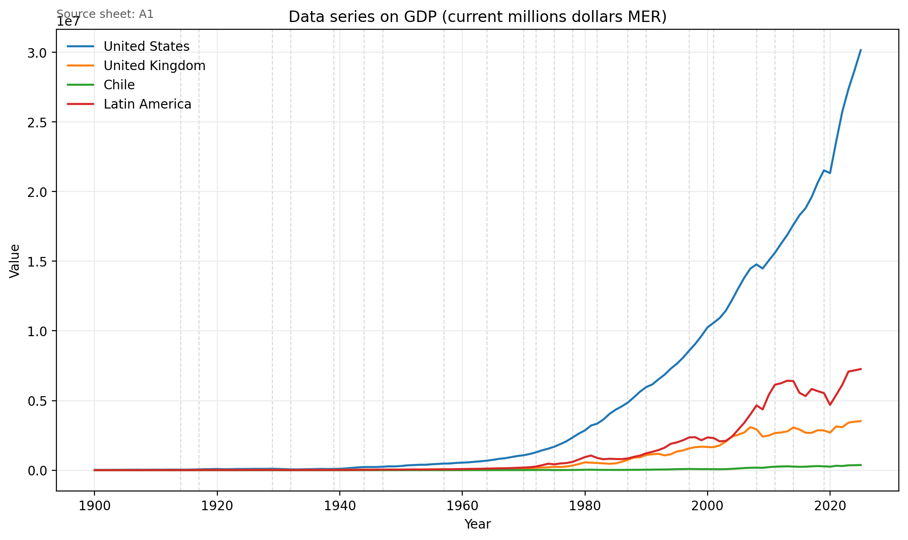

`figures/png/A1_data_series_on_gdp_current_millions_dollars_mer.png`

`figures/pdf/A1_data_series_on_gdp_current_millions_dollars_mer.pdf`

### Data series on net trade balance (goods) (% GDP)

Diagnostic note: entities available = Chile, Latin America, United Kingdom, United States; year range = 1900-2025; missingness share = 0.0%; source sheet = `B1a`.

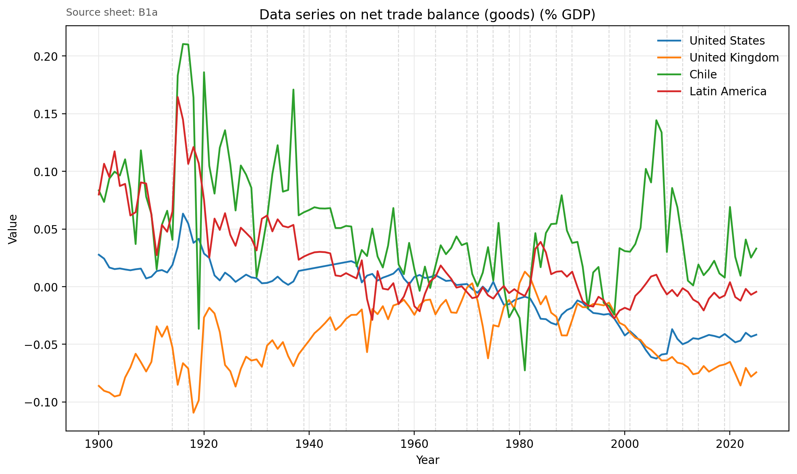

`figures/png/B1a_data_series_on_net_trade_balance_goods_gdp.png`

`figures/pdf/B1a_data_series_on_net_trade_balance_goods_gdp.pdf`

### Data series on exports in goods (% GDP)

Diagnostic note: entities available = Chile, Latin America, United Kingdom, United States; year range = 1900-2025; missingness share = 0.0%; source sheet = `B1b`.

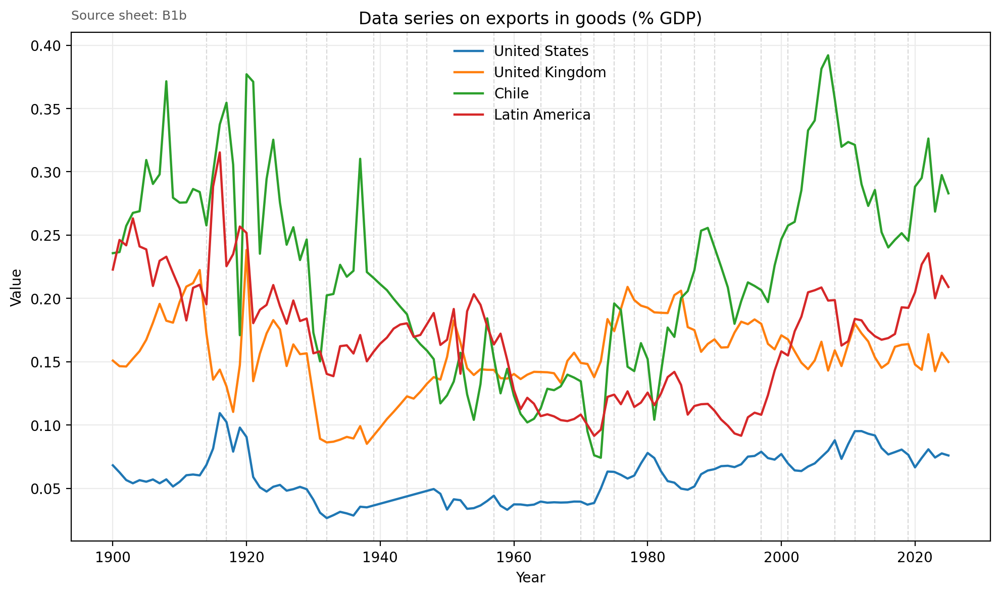

`figures/png/B1b_data_series_on_exports_in_goods_gdp.png`

`figures/pdf/B1b_data_series_on_exports_in_goods_gdp.pdf`

### Data series on imports in goods (% GDP)

Diagnostic note: entities available = Chile, Latin America, United Kingdom, United States; year range = 1900-2025; missingness share = 0.0%; source sheet = `B1c`.

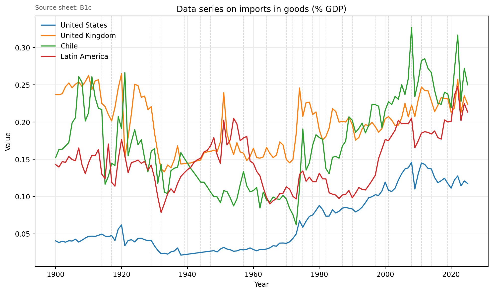

`figures/png/B1c_data_series_on_imports_in_goods_gdp.png`

`figures/pdf/B1c_data_series_on_imports_in_goods_gdp.pdf`

### Data series on net trade balance (primary commodities) (% GDP)

Diagnostic note: entities available = Chile, Latin America, United Kingdom, United States; year range = 1900-2025; missingness share = 0.0%; source sheet = `B2a`.

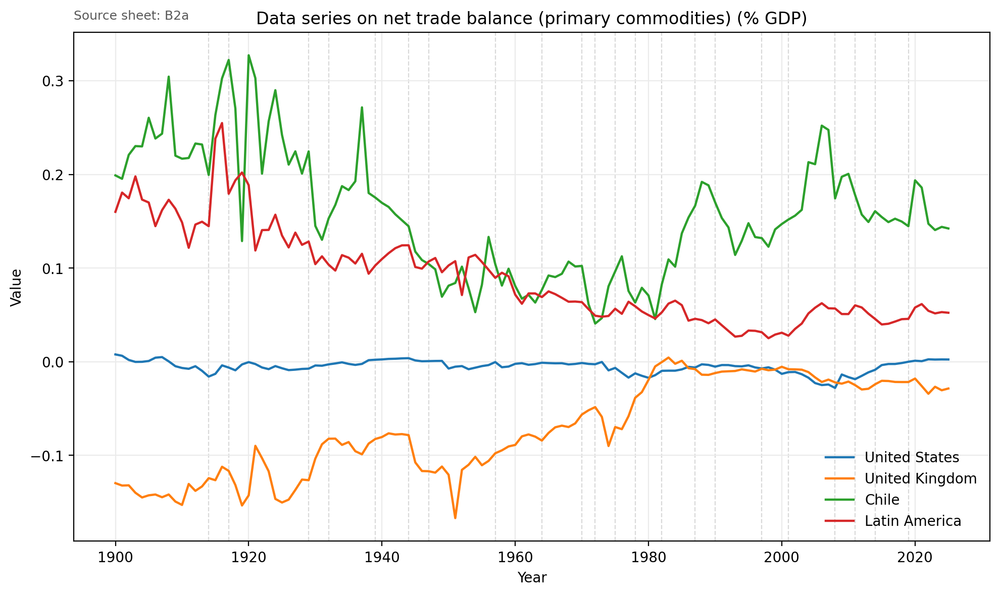

`figures/png/B2a_data_series_on_net_trade_balance_primary_commodities_gdp.png`

`figures/pdf/B2a_data_series_on_net_trade_balance_primary_commodities_gdp.pdf`

### Data series on exports in primary commodities (% GDP)

Diagnostic note: entities available = Chile, Latin America, United Kingdom, United States; year range = 1900-2025; missingness share = 0.0%; source sheet = `B2b`.

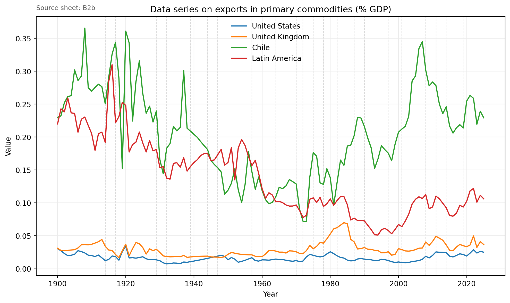

`figures/png/B2b_data_series_on_exports_in_primary_commodities_gdp.png`

`figures/pdf/B2b_data_series_on_exports_in_primary_commodities_gdp.pdf`

### Data series on imports in primary commodities (% GDP)

Diagnostic note: entities available = Chile, Latin America, United Kingdom, United States; year range = 1900-2025; missingness share = 0.0%; source sheet = `B2c`.

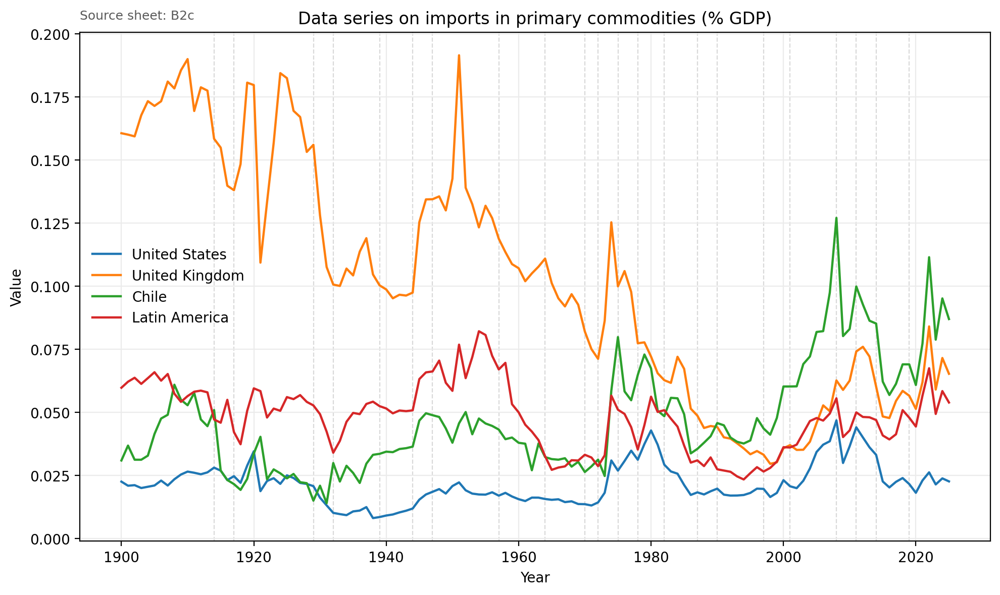

`figures/png/B2c_data_series_on_imports_in_primary_commodities_gdp.png`

`figures/pdf/B2c_data_series_on_imports_in_primary_commodities_gdp.pdf`

### Data series on net trade balance (manufactured goods) (% GDP)

Diagnostic note: entities available = Chile, Latin America, United Kingdom, United States; year range = 1900-2025; missingness share = 0.0%; source sheet = `B3a`.

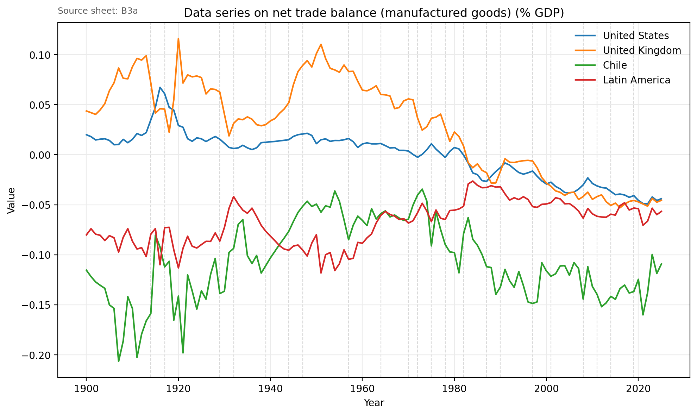

`figures/png/B3a_data_series_on_net_trade_balance_manufactured_goods_gdp.png`

`figures/pdf/B3a_data_series_on_net_trade_balance_manufactured_goods_gdp.pdf`

### Data series on exports in manufactured goods (% GDP)

Diagnostic note: entities available = Chile, Latin America, United Kingdom, United States; year range = 1900-2025; missingness share = 0.0%; source sheet = `B3b`.

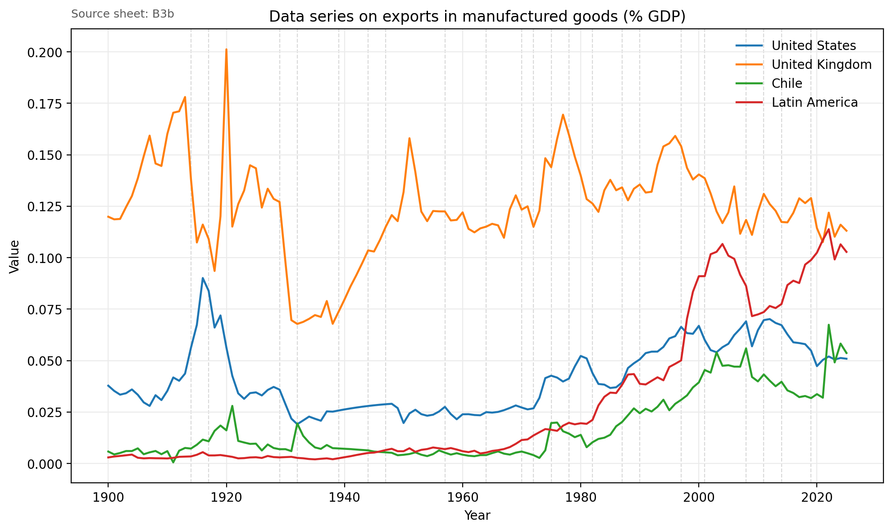

`figures/png/B3b_data_series_on_exports_in_manufactured_goods_gdp.png`

`figures/pdf/B3b_data_series_on_exports_in_manufactured_goods_gdp.pdf`

### Data series on imports in manufactured goods (% GDP)

Diagnostic note: entities available = Chile, Latin America, United Kingdom, United States; year range = 1900-2025; missingness share = 0.0%; source sheet = `B3c`.

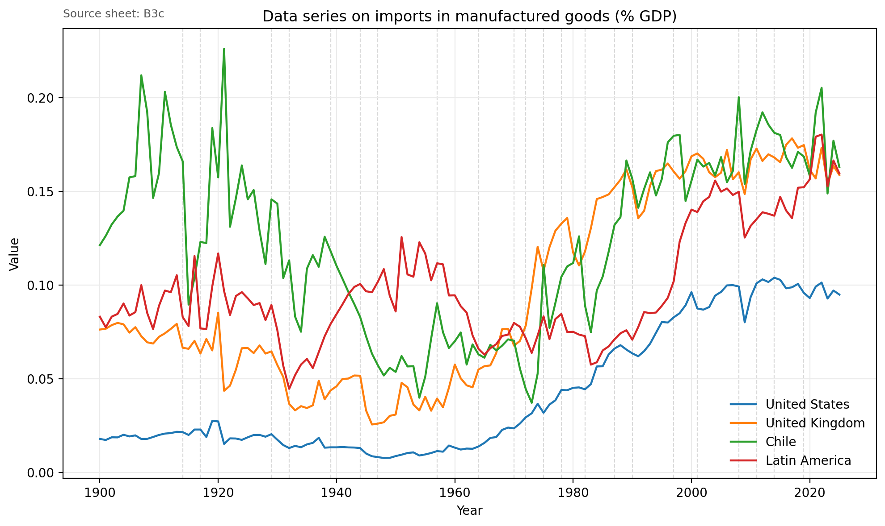

`figures/png/B3c_data_series_on_imports_in_manufactured_goods_gdp.png`

`figures/pdf/B3c_data_series_on_imports_in_manufactured_goods_gdp.pdf`

### Data series on net trade balance (services) (% GDP)

Diagnostic note: entities available = Chile, Latin America, United Kingdom, United States; year range = 1900-2025; missingness share = 0.0%; source sheet = `C1a`.

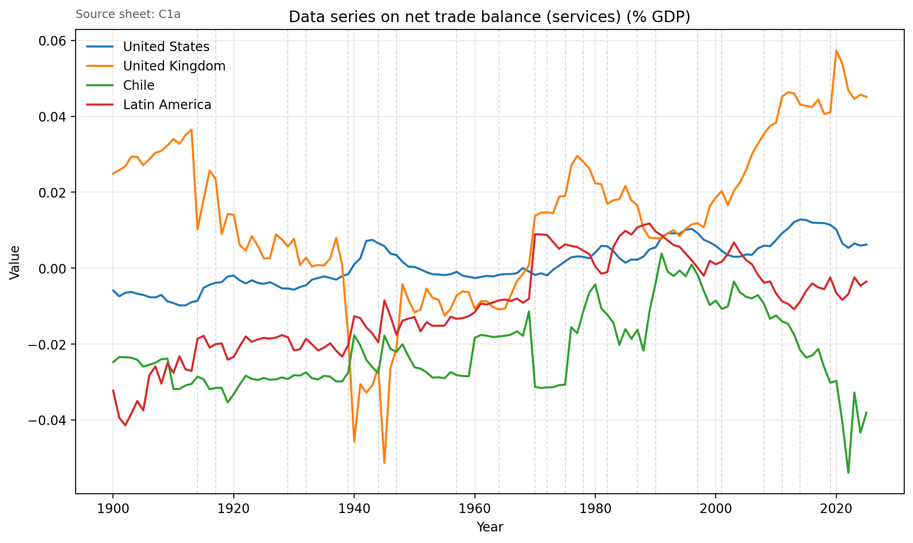

`figures/png/C1a_data_series_on_net_trade_balance_services_gdp.png`

`figures/pdf/C1a_data_series_on_net_trade_balance_services_gdp.pdf`

### Data series on exports in services (% GDP)

Diagnostic note: entities available = Chile, Latin America, United Kingdom, United States; year range = 1900-2025; missingness share = 0.0%; source sheet = `C1b`.

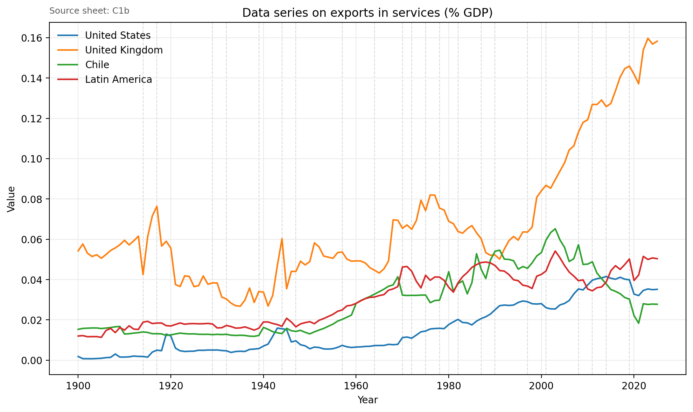

`figures/png/C1b_data_series_on_exports_in_services_gdp.png`

`figures/pdf/C1b_data_series_on_exports_in_services_gdp.pdf`

### Data series on imports in services (% GDP)

Diagnostic note: entities available = Chile, Latin America, United Kingdom, United States; year range = 1900-2025; missingness share = 0.0%; source sheet = `C1c`.

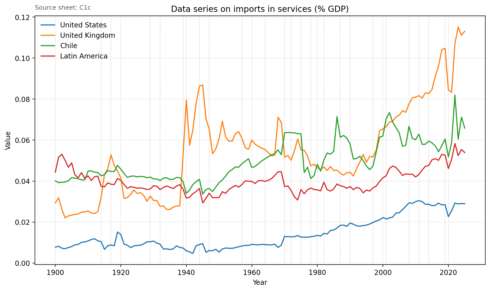

`figures/png/C1c_data_series_on_imports_in_services_gdp.png`

`figures/pdf/C1c_data_series_on_imports_in_services_gdp.pdf`

### Data series on net trade balance (goods+services) (% GDP)

Diagnostic note: entities available = Chile, Latin America, United Kingdom, United States; year range = 1900-2025; missingness share = 0.0%; source sheet = `C1d`.

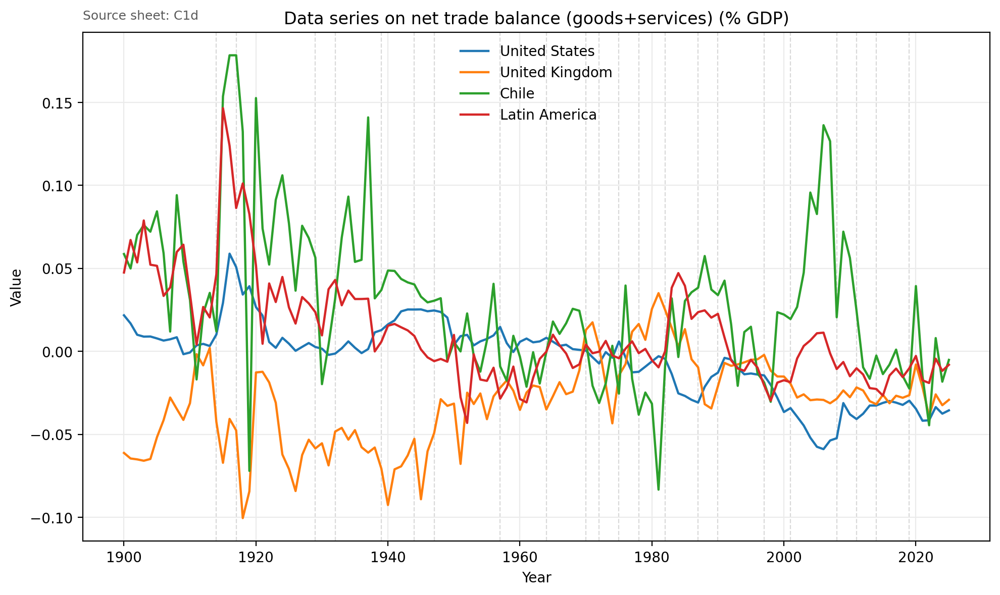

`figures/png/C1d_data_series_on_net_trade_balance_goods_services_gdp.png`

`figures/pdf/C1d_data_series_on_net_trade_balance_goods_services_gdp.pdf`

### New series on exports in goods + services (% GDP) (MER $)

Diagnostic note: entities available = Chile, Latin America, United Kingdom, United States; year range = 1900-2023; missingness share = 0.0%; source sheet = `C1e`.

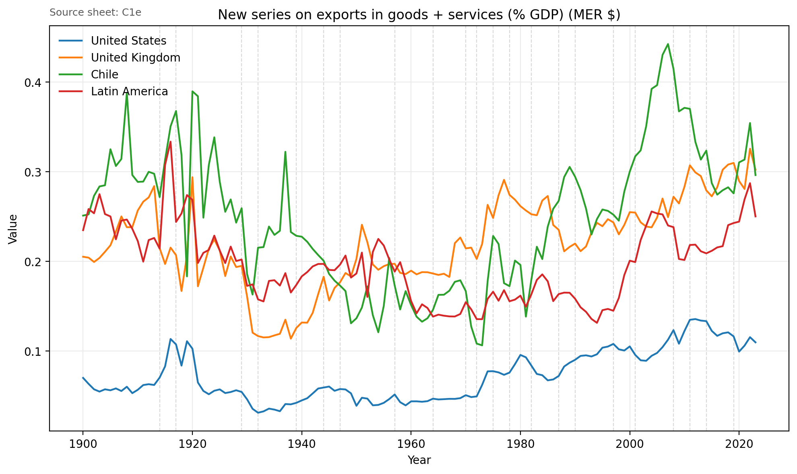

`figures/png/C1e_new_series_on_exports_in_goods_services_gdp_mer.png`

`figures/pdf/C1e_new_series_on_exports_in_goods_services_gdp_mer.pdf`

### New series on imports in goods + services (% GDP) (MER $)

Diagnostic note: entities available = Chile, Latin America, United Kingdom, United States; year range = 1900-2023; missingness share = 0.0%; source sheet = `C1f`.

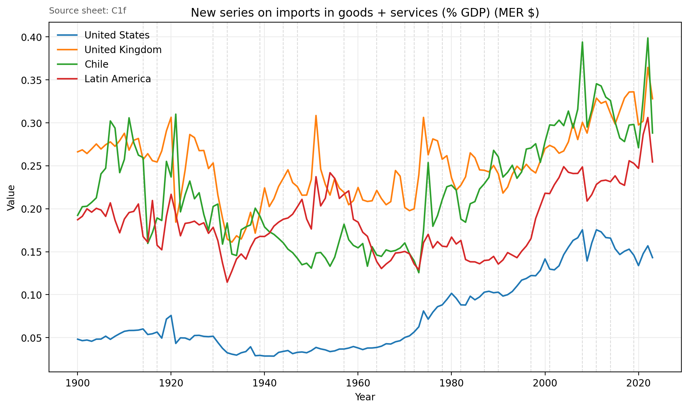

`figures/png/C1f_new_series_on_imports_in_goods_services_gdp_mer.png`

`figures/pdf/C1f_new_series_on_imports_in_goods_services_gdp_mer.pdf`

### Data series on net income balance (% GDP)

Diagnostic note: entities available = Chile, Latin America, United Kingdom, United States; year range = 1900-2025; missingness share = 0.0%; source sheet = `D1a`.

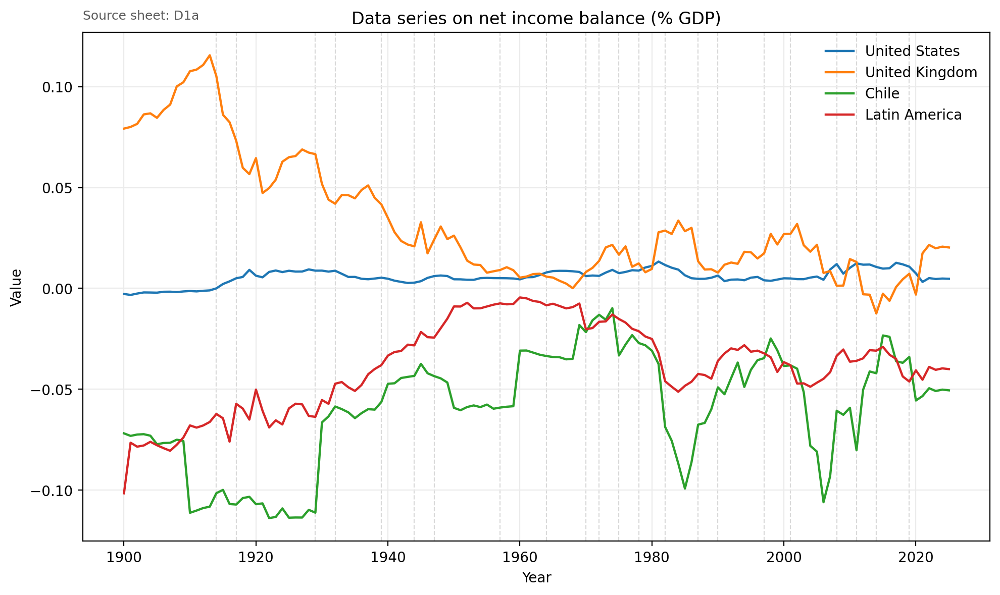

`figures/png/D1a_data_series_on_net_income_balance_gdp.png`

`figures/pdf/D1a_data_series_on_net_income_balance_gdp.pdf`

### Data series on foreign income inflows (% GDP)

Diagnostic note: entities available = Chile, Latin America, United Kingdom, United States; year range = 1900-2025; missingness share = 0.0%; source sheet = `D1b`.

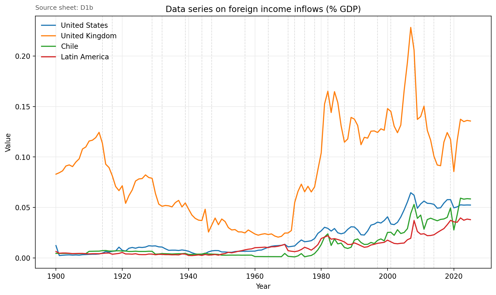

`figures/png/D1b_data_series_on_foreign_income_inflows_gdp.png`

`figures/pdf/D1b_data_series_on_foreign_income_inflows_gdp.pdf`

### Data series on foreign income outflows (% GDP)

Diagnostic note: entities available = Chile, Latin America, United Kingdom, United States; year range = 1900-2025; missingness share = 0.0%; source sheet = `D1c`.

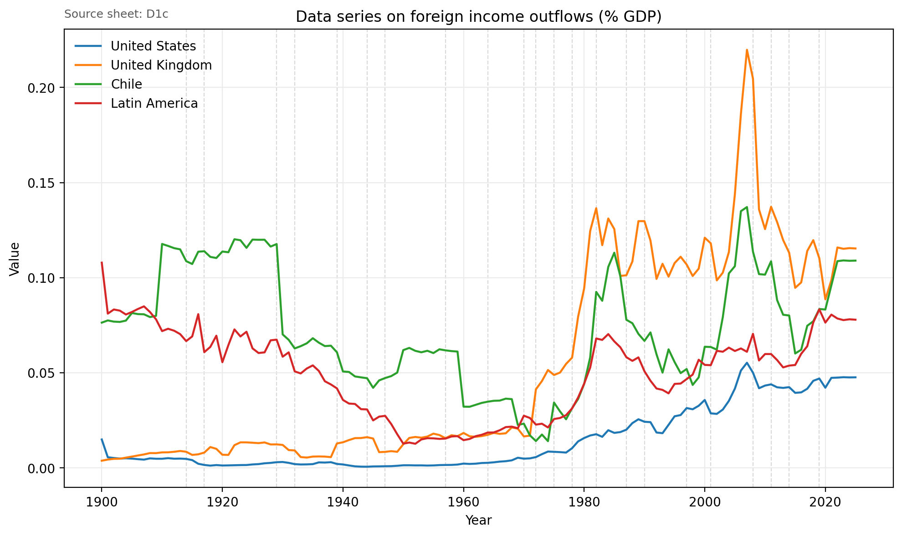

`figures/png/D1c_data_series_on_foreign_income_outflows_gdp.png`

`figures/pdf/D1c_data_series_on_foreign_income_outflows_gdp.pdf`

### Data series on net transfer balance (% GDP)

Diagnostic note: entities available = Chile, Latin America, United Kingdom, United States; year range = 1900-2025; missingness share = 0.0%; source sheet = `E1a`.

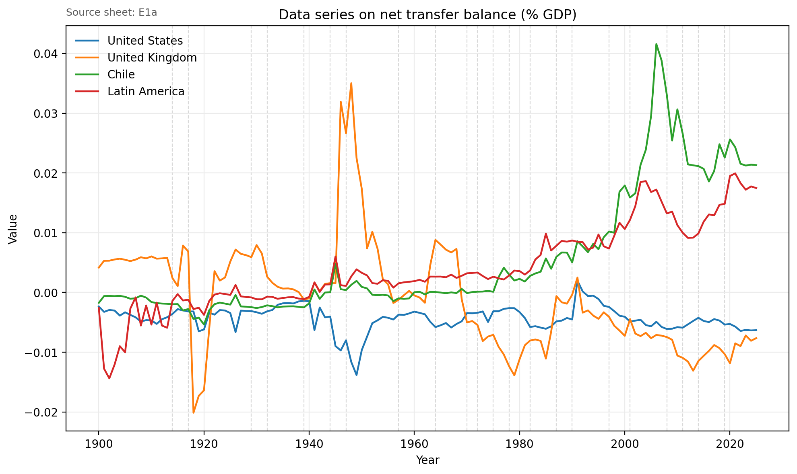

`figures/png/E1a_data_series_on_net_transfer_balance_gdp.png`

`figures/pdf/E1a_data_series_on_net_transfer_balance_gdp.pdf`

### Data series on foreign transfer inflows (% GDP)

Diagnostic note: entities available = Chile, Latin America, United Kingdom, United States; year range = 1900-2025; missingness share = 0.0%; source sheet = `E1b`.

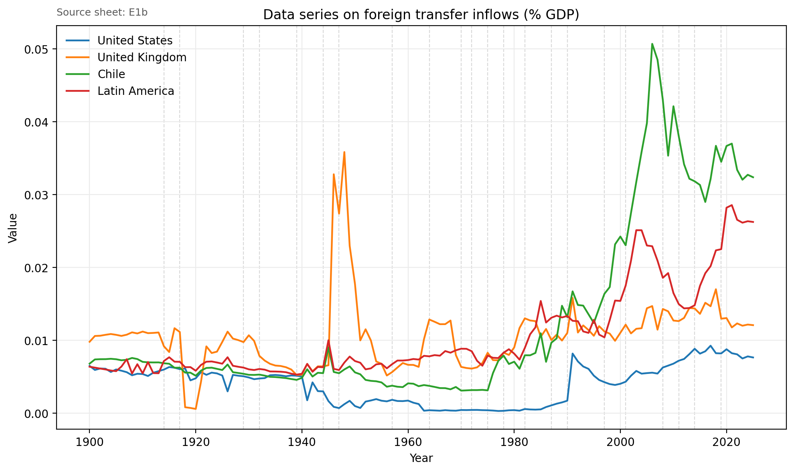

`figures/png/E1b_data_series_on_foreign_transfer_inflows_gdp.png`

`figures/pdf/E1b_data_series_on_foreign_transfer_inflows_gdp.pdf`

### Data series on foreign transfer outflows (% GDP)

Diagnostic note: entities available = Chile, Latin America, United Kingdom, United States; year range = 1900-2025; missingness share = 0.0%; source sheet = `E1c`.

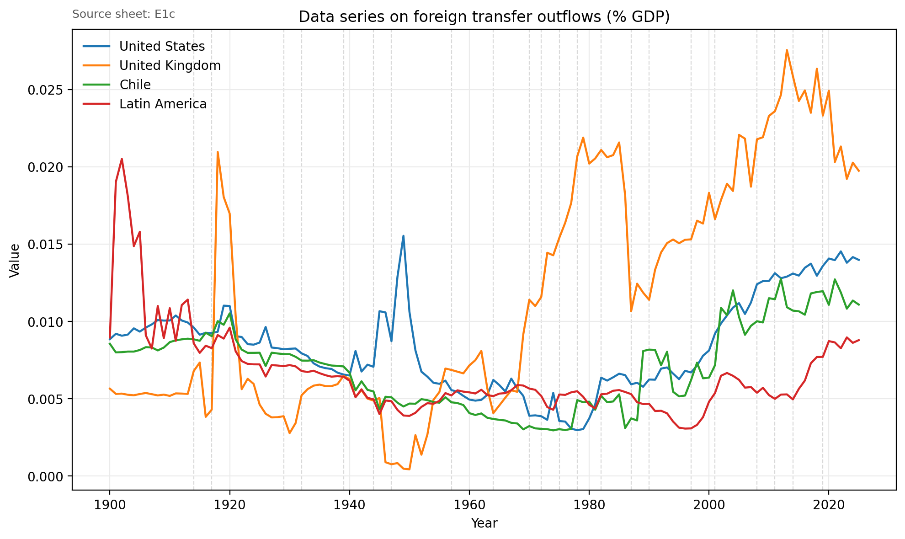

`figures/png/E1c_data_series_on_foreign_transfer_outflows_gdp.png`

`figures/pdf/E1c_data_series_on_foreign_transfer_outflows_gdp.pdf`

### Data series on net current account (% GDP)

Diagnostic note: entities available = Chile, Latin America, United Kingdom, United States; year range = 1900-2025; missingness share = 0.0%; source sheet = `F1`.

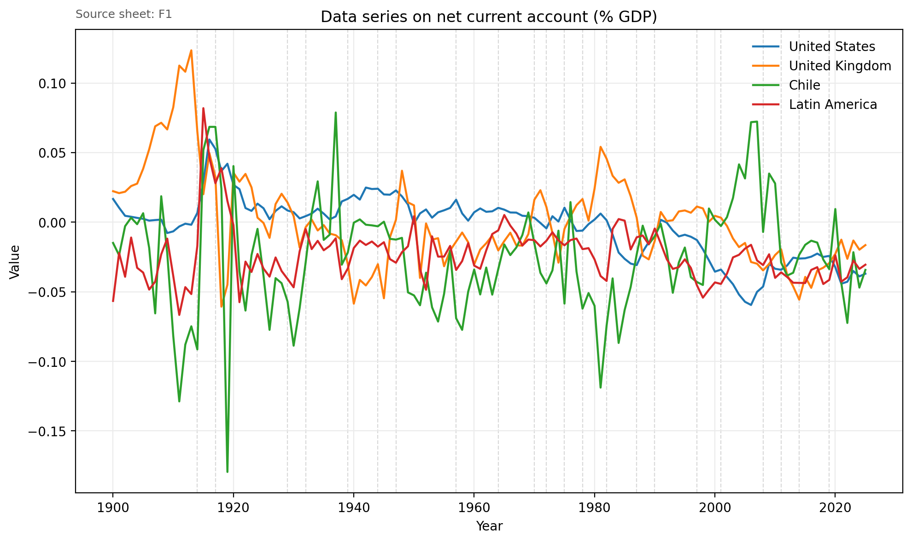

`figures/png/F1_data_series_on_net_current_account_gdp.png`

`figures/pdf/F1_data_series_on_net_current_account_gdp.pdf`

### Data series on foreign wealth across world regions (% GDP)

Diagnostic note: entities available = Chile, Latin America, United Kingdom, United States; year range = 1900-2025; missingness share = 0.0%; source sheet = `G1a`.

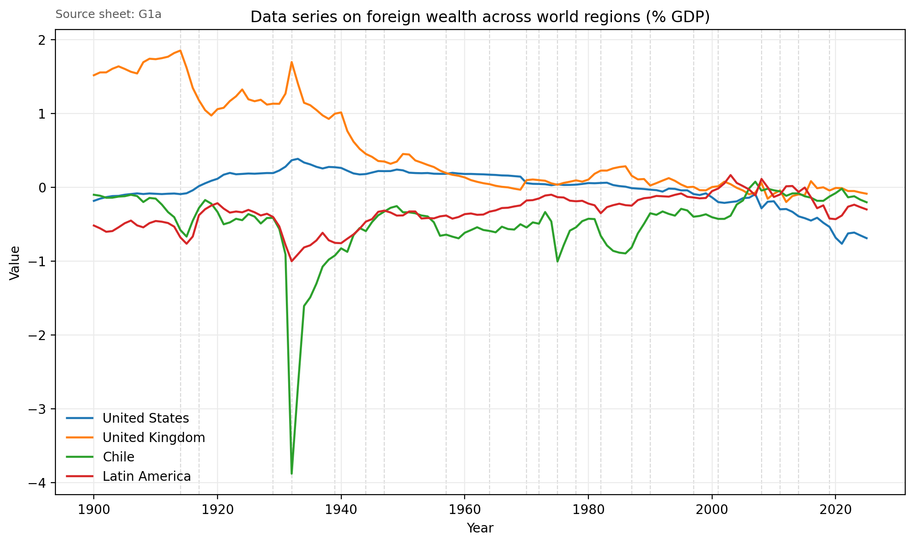

`figures/png/G1a_data_series_on_foreign_wealth_across_world_regions_gdp.png`

`figures/pdf/G1a_data_series_on_foreign_wealth_across_world_regions_gdp.pdf`

### Data series on gross foreign assets (% GDP)

Diagnostic note: entities available = Chile, Latin America, United Kingdom, United States; year range = 1900-2025; missingness share = 0.0%; source sheet = `G1b`.

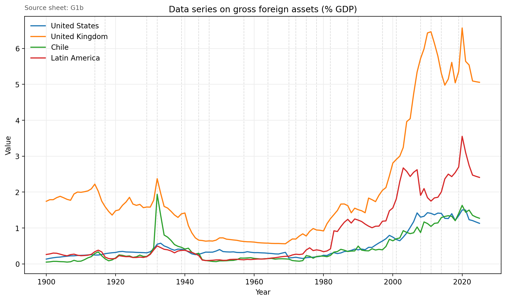

`figures/png/G1b_data_series_on_gross_foreign_assets_gdp.png`

`figures/pdf/G1b_data_series_on_gross_foreign_assets_gdp.pdf`

### Data series on gross foreign liabilities (% GDP)

Diagnostic note: entities available = Chile, Latin America, United Kingdom, United States; year range = 1900-2025; missingness share = 0.0%; source sheet = `G1c`.

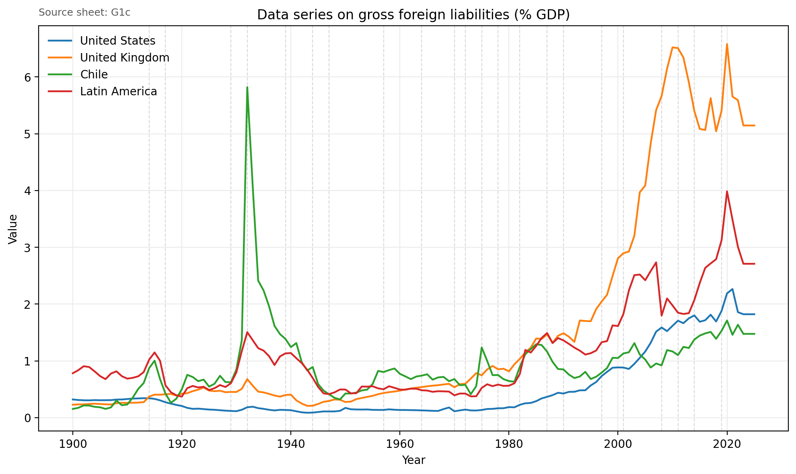

`figures/png/G1c_data_series_on_gross_foreign_liabilities_gdp.png`

`figures/pdf/G1c_data_series_on_gross_foreign_liabilities_gdp.pdf`

## 6. Descriptive synthesis

The inspection covers 26 plotted variables from 1900 to 2025 after the 1900 filter. 26 variables have zero post-1900 missingness across the four requested entities, and the average missingness share across plotted variables is 0.0%.
The bundle separates one level series in current millions of dollars from a larger block of percentage-of-GDP flow and stock series. That distinction matters visually: the GDP sheet tracks long-run scale divergence, while the trade, income, transfer, current-account, and foreign-wealth sheets emphasize oscillation, sign changes, and discrete breaks.
The external stock sheets (`G1a`, `G1b`, `G1c`) show the sharpest swings and level shifts in the bundle. The flow sheets are generally tighter, but they still show visible breaks around interwar, postwar, 1970s, early-1980s, and post-2008 intervals.
Coverage remains uneven across variables rather than across the selected entities alone. The figures identify where continuity is strong enough for later substantive work and where semantic cleaning or closer source validation should come first.

## 7. Audit appendix

No numeric variables from the used data sheets were excluded from the visual bundle.

Remaining ambiguities or relabeling items:
- WBOP coverage sheet uses 'USA' while numeric data sheets use 'US'.
- WBOP coverage sheet uses 'Britain' while numeric data sheets use 'GB'.
- WBOP coverage sheet spells out 'Chile' while numeric data sheets use 'CL'.

Variables that may need later semantic cleaning:
- Country and region headers are a mix of spelled-out aggregates and short codes. The visual bundle standardizes only the requested four entities, leaving the broader codebook to a later pass.
- Some sheets normalize region names slightly differently (`North America/ Oceania` vs `North America Oceania`; `Subsaharan Africa` vs `Sub-Saharan Africa`).

## 8. Processed Chile–United States outputs

Processed panel: `C:\ReposGitHub\Capacity-Utilization-US_Chile\data\processed\wbop_chile_us_panel.csv`.
User guide: `C:\ReposGitHub\Capacity-Utilization-US_Chile\data\processed\wbop_chile_us_user_guide.md`.
Variable inventory workbook: `C:\ReposGitHub\Capacity-Utilization-US_Chile\data\processed\wbop_variable_inventory.xlsx`.
The processed panel keeps one row per standardized entity-year and preserves the original variable names as wide data columns. That choice matches the workbook’s one-sheet-per-variable structure and avoids an unnecessary long-to-wide-to-long cycle.
